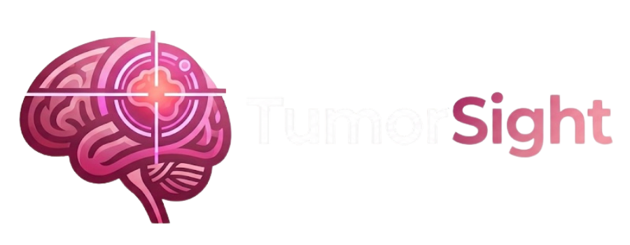
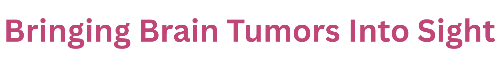
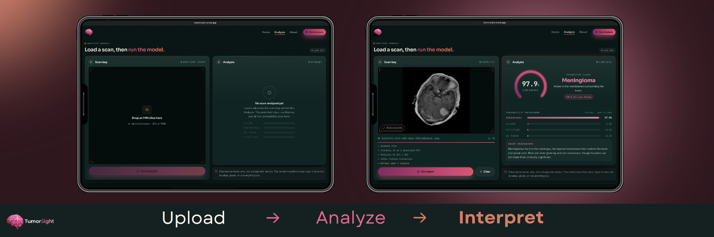
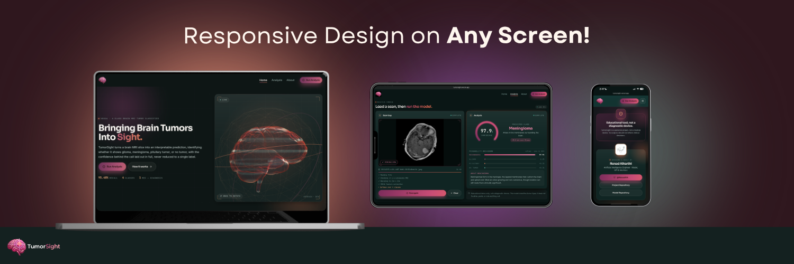
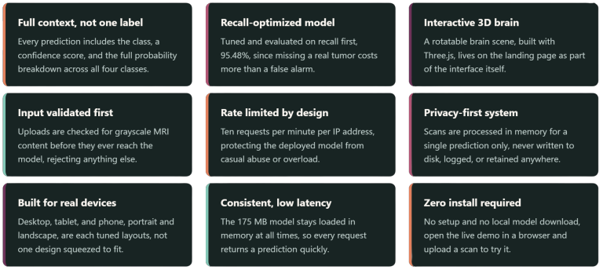
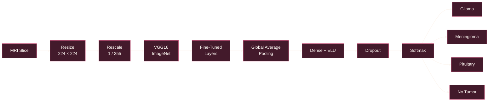
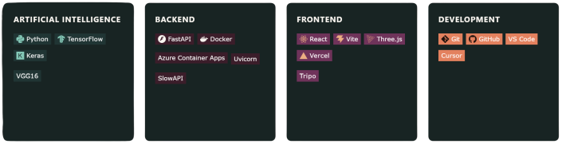
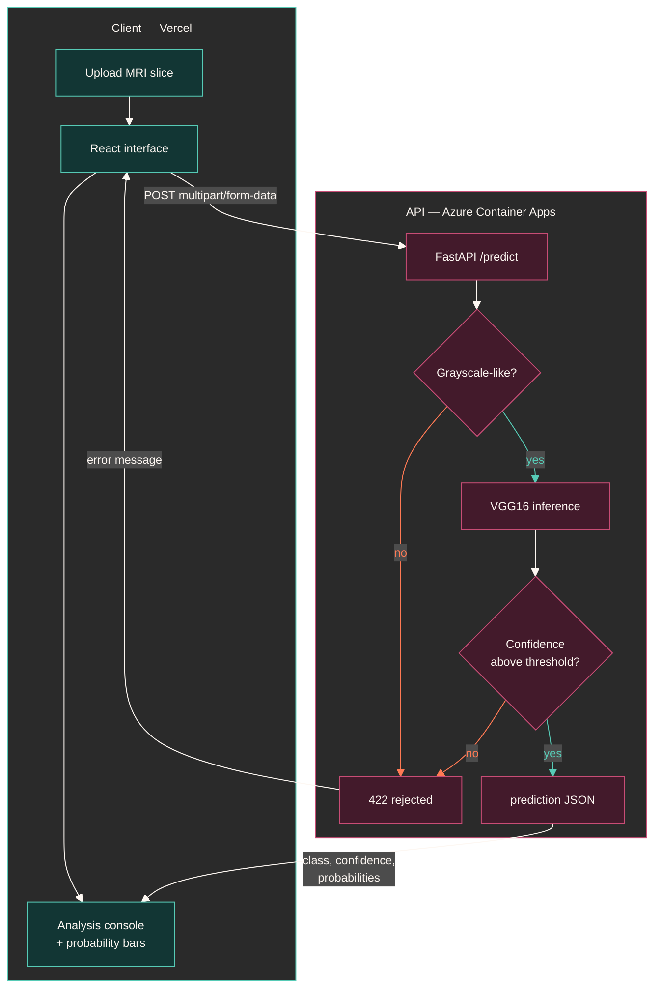

<div align="center">

<div style="margin-left: -22px;">
  
</div>


<div style="margin-right: -3px;">
 
</div>
<br />
<div>
  An intelligent web-based system that leverages deep learning to classify brain tumors from MRI scans, delivering interpretable predictions through a seamless interactive experience.
</div>
<br />

[](https://tumorsight.vercel.app)
[](https://github.com/RenadAlh/VGG16TumorClassification)


</div>


## 01 · Overview

<div align="center">

TumorSight combines a [VGG16-based model](https://github.com/RenadAlh/VGG16TumorClassification) with an interactive web interface to classify brain MRI slices and make the results easy to explore. Upload a scan, run the analysis, and see the prediction alongside its confidence and full probability breakdown.
 

```
     SCAN                 AI                  INSIGHT
   │                   │                      │
   ▼                   ▼                      ▼
    MRI SLICE  ───▶  VGG16  +  SOFTMAX  ───▶   PREDICTION
```
 
**Glioma · Meningioma · Pituitary · No Tumor**
 

https://github.com/user-attachments/assets/30219e45-9452-47d7-9ef8-87d55e661a92
 
<sub>Explore TumorSight end to end! landing, analysis, and about.</sub>
 
</div>

## 02 · The experience

### 01 · Analyze a scan

<div align="center">



</div>

<br>

TumorSight's analysis console guides reviewers seamlessly from raw MRI Image ingestion to an interpretable output.
 
1. **Upload:** Drag and drop an MRI slice into the secure analysis bay with automated format pre-checking.
2. **Analyze:** Run the VGG16 model to evaluate tensor features and check prediction thresholds.
3. **Interpret:** Review the confidence score, probability breakdown bars, and detailed class insights.

<br>

---

### 02 · Built for every screen

<div align="center">



</div>

<br>

TumorSight is designed as a responsive experience across desktop, tablet, and mobile, with dedicated layouts for both portrait and landscape orientations. Height-constrained screens receive their own treatment so the interface remains usable without sacrificing the core experience.

<br>

## 03 · Features
 
<div align="center">  </div>
<br />


## 04 · Model

TumorSight uses a VGG16 backbone pretrained on ImageNet, followed by Global Average Pooling, a 128-unit ELU hidden layer, and a 4-unit softmax output layer. The pretrained features are fine-tuned on brain MRI slices for tumor classification.

For the full architecture, experiments, and training process, see the [Model Research Repository.](https://github.com/RenadAlh/VGG16TumorClassification) 


<br>

<div align="center">

<table align="center">
  <tr>
    <th width="300"><div align="center">Metric</div></th>
    <th width="300"><div align="center">Value</div></th>
  </tr>
  <tr>
    <td><div align="center"><strong>Recall</strong></div></td>
    <td><div align="center"><strong>95.48%</strong></div></td>
  </tr>
  <tr>
    <td><div align="center">Precision</div></td>
    <td><div align="center">95.54%</div></td>
  </tr>
  <tr>
    <td><div align="center">F1-score</div></td>
    <td><div align="center">95.45%</div></td>
  </tr>
</table>

</div>
 
 
> **Recall is the primary metric.** 
> In medical classification, missing a real tumor is more costly than a false positive, so the model prioritizes detecting actual tumor cases over overall accuracy.

<br>


## 05 · Tech stack

<div align="center">  </div>
<br />

<br>

## 06 · System


The interface and the model are two independently deployed services, a single POST /predict endpoint returns clean JSON, CORS-locked to the deployed frontend's own origin.
 
```bash
curl -X POST https://tumorsight-api.../predict \
  -F "file=@scan.jpg"
```
 
```json
{
  "predicted_class": "meningioma",
  "confidence": 0.958,
  "probabilities": {
    "meningioma": 0.958,
    "glioma": 0.031,
    "notumor": 0.009,
    "pituitary": 0.002
  }
}
```
<br>

## 07 · Project structure

Two independent services in one repository: a Python inference API and a React
single-page app. Neither imports from the other, they meet only at `POST /predict`.

```
TumorSight/
│
├── backend/                                  Inference service — Docker → Azure Container Apps
│   ├── app.py                                FastAPI app: model load, MRI validation, /predict
│   ├── vgg16_tumor_model_95_accuracy.h5      Trained model, 175 MB, tracked via Git LFS
│   ├── requirements.txt                      Pinned Python dependencies
│   └── Dockerfile                            Container image for deployment
│
├── frontend/                                 Interface, Vite build → Vercel
│   ├── src/
│   │   ├── pages/
│   │   │   ├── Landing.jsx                   Hero, 3D brain, project overview
│   │   │   ├── Demo.jsx                      Analysis console: upload → analyze → interpret
│   │   │   └── About.jsx                     Model, metrics, and disclaimer
│   │   ├── components/
│   │   │   ├── BrainScene.jsx                Three.js scene, camera, and interaction
│   │   │   ├── brainGeometry.js              Procedural brain, stands in while brain.glb loads
│   │   │   ├── hologramMaterial.js           Custom emissive shader for the hologram look
│   │   │   ├── brain.glb                     3D brain model
│   │   │   ├── dataviz.jsx                   Confidence ring, probability bars, count-up
│   │   │   ├── ui.jsx                        Logo, buttons, and shared primitives
│   │   │   ├── Navbar.jsx                    Top navigation
│   │   │   └── Footer.jsx                    Footer
│   │   ├── assets/                           Logo lockup, mark, and profile image
│   │   ├── theme.js                          Palette and per-class metadata
│   │   ├── index.css                         Design tokens and component styles
│   │   ├── App.jsx                           Routes
│   │   └── main.jsx                          Entry point
│   ├── vercel.json                           SPA rewrite, fixes 404 on refresh
│   ├── vite.config.js                        Build config
│   ├── tailwind.config.js                    Tailwind theme extension
│   └── package.json                          Frontend dependencies and scripts
│
└── assets/                                   Screenshots used in this README
```

## 08 · Quick start

**Installation**
```bash
cd backend
python -m venv venv
.\venv\Scripts\Activate.ps1        # or source venv/bin/activate on macOS/Linux
pip install -r requirements.txt
```

**Configuration**
```bash
cd frontend
npm install
```

**Run locally**
```bash
# backend
python -m uvicorn app:app --reload --port 8000

# frontend, in a second terminal
cd frontend
npm run dev
```

## 09 · Disclaimer

TumorSight is a personal project. It is *not registered, cleared, or approved as a medical device*.


---

<div align="center">


**Designed & built by**

**RENAD ALHARTHI**
<br />
Artificial Intelligence Engineer


<a href="https://github.com/RenadAlh">

</a>

</div>
 
